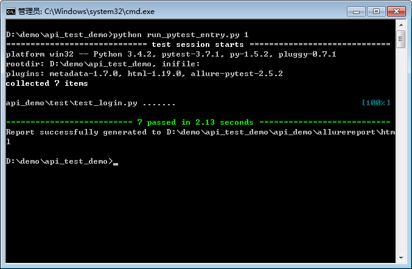

# api_test_demo

## 简介
整理如何用 pytest 编写接口测试用例，使用 pytest+allure 生成报表。
每个接口只需要写上接口地址、加密参数列表，即可快速编写对应的测试用例。

## 如何运行
- 下载源码。
- 安装 requirements
- 运行 run.bat/ run.sh 文件开始执行。
- 报告生成：每次运行会生成新的报告目录， 打开 api_demo/allure-report/时间日期/html  下的 index.html 文件查看 allure 报告。（需要安装 allure ）




## 结构介绍

### 1. 通用接口功能
api_demo.api_manage.api_base   通用方法： 如何为登录接口进行签名、拼接参数和url，及发送。

#### 1.1 ： 签名加密方法

```
def getOsign(user,osign_list):   # 签名方法。  这里举例是进行 MD5 加密， 具体需要替换为实际的签名方法。
    user['osign'] = util.getOsign(user, osign_list)
    return user

 def getOsign(user,osignList):
    paraPand = ''
    for para in osignList:
        paraPand += str(user[para])
    return md5(paraPand)
  ```

#### 1.2 ：接口参数拼接和发送

```
def api_send(user,osign_list,url,need_osign = True,isMock=False):     # 具体的接口url 拼接、参数生成和发送方法
    if need_osign:
        getOsign(user,osign_list)
    return send(user, url,isMock=isMock)

# http post 发送
 def send(user,url,isMock=False,host=host,needJson=True):
    body = json.dumps(user, default=lambda user: user.__dict__, sort_keys=True, skipkeys=True)
    body = eval(body)
    list = util.dict_2_str(body)
    url = host+url+ '?' + list
    print(url)
    if isMock:
        return mockData.mockData(url)
    else:
        response, content = util.sendRequest(url)
        print(content)
        if needJson:
            content = json.loads(content)
        return content
```

### 2. 模拟接口功能实现
api_demo.mock     示例如何为登录接口生成mock 数据。
#### 使用说明： 如果接口已开发完成，可以使用，可忽略这步。

```
def login(self,query):
    data = {}
    osign = query['osign'][0]
    userName = query['userName'][0]
    password = query['password'][0]
    verifyCode = query['verifyCode'][0]
    if osign != util.md5(userName +password+verifyCode) or verifyCode !='123456':      # 签名不匹配，或者验证码错误
        data['code']=4010
        data['msg']='invalid request!'
    elif userName !='correctuser' or password !='correctpassword' :                # 用户名或密码错误
        data['code']=500
        data['msg']='username or password is wrong ,please try again!'
    else:                                                                               # 正常登录
        data['code']=200
        data['msg']='success!'
        data['loginTime'] = self.loginTime
    return data
```

### 3. 测试用例（可根据test_login.py 作为模板，编写你的测试用例）
 api_demo.test  示例如何编写不同场景的测试用例。

#### 使用说明： 如果不需要使用 mock ，将 isMock 改为 False 即可; 填写具体的签名列表、接口地址
```
isMock = True    # 如果不需要使用 mock ，直接使用接口，此处改为 False
osign_list = ['userName', 'password','verifyCode']    # 定义签名参数列表，例如签名方法为 username+password+verifycode 做md5 。  具体需要替换为实际的签名参数列表。
url = '/login'    # 具体的接口 url 相对路径， 测试时会拼凑为完整路径：  http://host/login
```
#### conftest 文件配置初始化

```
import pytest
@pytest.fixture(scope='module')
def init_test_user():

    # 通用参数初始化
    testuesr = {}
    testuesr['userName']='correctuser'
    testuesr['password']='correctpassword'
    testuesr['verifyCode']='123456'
    return testuesr

```

#### 具体测试方法如下：
```commandline

# 正常场景：login 是否成功。
def test_login(init_test_user):
    testuesr = init_test_user
    result =api_send(testuesr,osign_list,url,isMock=isMock)
    assert result['code']==code_success
    assert result['msg']==msg_success

@pytest.mark.skipif(environmentFlag =='1', reason='skip')
# 异常场景： userName错误。
def test_login_wrong_userName(init_test_user):
    testuesr = init_test_user
    print(environmentFlag =='1')
    print('evironment is : ',environmentFlag)
    testuesr['userName']='username'
    result = api_send(testuesr,osign_list,url,isMock=isMock)
    assert result['code'] == code_login_fail
    assert result['msg'] == msg_login_fail

@pytest.mark.skipif(isMock is False , reason='skip')
# 异常场景： password错误。
def test_login_wrong_password(init_test_user):
    testuesr = init_test_user
    testuesr['password']='password'
    result = api_send(testuesr,osign_list,url,isMock=isMock)
    assert result['code'] == code_login_fail
    assert result['msg'] == msg_login_fail


# 异常场景： verifyCode错误。
def test_login_wrong_verifyCode(init_test_user):
    testuesr = init_test_user
    testuesr['verifyCode']='123455'
    result = api_send(testuesr,osign_list,url,isMock=isMock)
    assert result['code'] == code_sign_error
    assert result['msg'] == msg_sign_error

# 异常场景： 签名错误。
def test_login_osign_error(init_test_user):
    testuesr = init_test_user
    from api_demo.api_manage import api_base
    assert api_base.test_osign_error(testuesr,osign_list,url,code_sign_error,msg_sign_error,isMock=isMock)== 0

```

参数化：
```commandline
@pytest.mark.parametrize("user", valid_user)
def test_login_para(init_test_user,user):
    print(user)
```


通用的签名错误校验方法：
```
# 传入：签名参数列表 osign_list；   返回签名不匹配的参数数量，如果返回 0 ，表示测试通过
def test_osign_error(user,osign_list,url,code_sign_error,msg_sign_error,isMock=False):
        osignFailCount = 0
        for para in osign_list:
            result = osign_error(user,osign_list,url,code_sign_error,msg_sign_error,para,isMock=isMock)
            if not result:
                osignFailCount += 1
        print('osign para lenth : %d' % len(osign_list))
        return osignFailCount

# 单个参数的签名校验：在生成完签名后修改某个参数值，看接口能否正确校验
def osign_error(user,osign_list,url,code_sign_error,msg_sign_error, para,isMock=False):
    if para in ['']:    # 过滤的加密参数，部分参数不需要加密验证
        return True
    else:
        user = getOsign(user,osign_list)
        if isinstance(user[para],int):
            user[para]= user[para] + 1
        else :
            user[para]=str(user[para] + '1')
    result = api_send(user, osign_list, url,need_osign=False,isMock=isMock)
    if result['code'] == code_sign_error and result['msg'] == msg_sign_error:
        return True
    else:
        print('osign error : %s, %s' % (para, result))
        return False
```

### 4. pytest 执行和 allure 报告生成
run_pytest_entry.py 、 run_pytest.py

### 4.1 通过 pytest mark 过滤需执行的用例：
```
@pytest.mark.skipif(environmentFlag =='1', reason='skip')   # 如果environmentFlag =='1'， 跳过
# 异常场景： userName错误。
 
@pytest.mark.skipif(isMock , reason='skip')     # 如果 isMock 为 true， 跳过
# 异常场景： password错误。

```

### 5. 环境配置
api_demo.__init__.py  文件中可以定义多个不同的测试环境地址，并通过 environmentFlag 进行切换：
```
environmentFlag='1'

if environmentFlag=='1':
    host = 'http://test1.com'
elif environmentFlag=='2':
    host = 'http://test2.com'
elif environmentFlag=='3':
    host = 'http://test3.com'
```

### 6. 命令行执行：run.bat/run.sh

```commandline
python run_pytest_entry.py 1

```

其中最后的参数 1 为 environmentFlag， 如果需要切换不同的测试环境，只需传入不同的标记位。

### 7. 其他插件使用

```commandline
 # pytest
 os.system('python -m pytest %s -n 3 --reruns 2 --dist=load --alluredir=%s -o log_cli=true -o log_cli_level=INFO' %(test_folder,report_path))
 # allure
 os.system('allure generate %s -o %s -c' %(report_path,allure_report_path))
```
pytest xdist 插件： 
用于多线程并发执行
-n 3 指定3个线程执行。

pytest rerunfailures 插件，通过 --reruns 2 指定失败重试的次数

